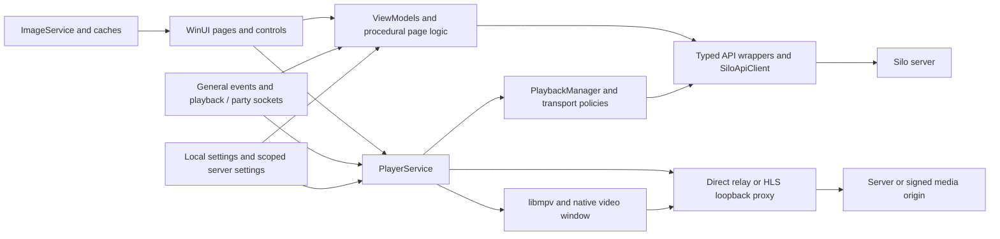

# Silo Desktop Player — fresh-eyes architecture and implementation audit

**Baseline: 1.1.101-multigpu-preview.1.** Reviewed September 7–8, 2026. This is an assessment and recommendation document; no application fixes, release, commit, deployment or production configuration changes were made.

## Overall verdict

**I would build the same kind of application with the same native foundations, but I would not reproduce its current internal organization and state coordination.**

The native Windows/C#/libmpv decision still fits the purpose exceptionally well: broad direct playback, high-bitrate media, hardware decoding, native subtitles and a browsing experience integrated with the server. There is no evidence here that changing the UI framework, adopting browser playback, adding microservices, or rewriting the entire product would produce a better result. Several recent improvements are thoughtful and should survive: strict progressive-stream recovery, explicit timeline conversion, server-authoritative playback planning, bounded library realization, artwork byte caching, and small policy classes with meaningful tests.

The weak point is **who owns a request, a piece of mutable state, or a resource after an asynchronous operation completes**. Playback, account/profile switching, Settings, realtime connections, artwork, readers and many pages answer that question differently. Some use strong ownership checks; others rely on booleans, current mutable fields, cancellation alone, or checks made after the mutation. The resulting defects are concrete: old plans can publish into replacement sessions; one settings scope can supply the rows saved to another; previews can disagree with saved collection queries; and a retained but inactive player overlay owns a subtitle-maintenance call that normal playback never executes.

**The desktop backend is not yet as stable, efficient or robust as it reasonably can be for this application.** It has sound transport and domain mechanisms wrapped in inconsistent orchestration. I recommend an incremental reconstruction of those boundaries, preserving working mechanisms and user behavior. A whole-product rewrite would be an unnecessarily risky way to achieve that.

This verdict concerns the desktop repository and its client-side services. It does **not** certify the production Go server, PostgreSQL, Redis, storage, transcode nodes or CDN. A fresh official-server reference was used for targeted contract checks; those systems were not comprehensively audited or load-tested.

## Baseline and evidence

The user explicitly confirmed `1.1.101-multigpu-preview.1` as `.101 QA`.

| Evidence | Result |
|---|---|
| Installed product identity | `1.1.101-multigpu-preview.1+721add16a6d96a9775a4efbfe3ab8c706eff514d` |
| Installed/staged application DLL | SHA-256 `91BB10675E915C0833026D6B288E66E070B810D515DB71994B63859579599A2F` — exact match |
| Production source correspondence | 358 source documents — 300 C# and 58 XAML files — matched the staged preview PDB checksums |
| Installed/source OSC | SHA-256 `4185775BD47B5AEEBF88D9711443F02BAA83E9EE35240CF52BC0B5FC86444FEE` — exact match |
| Installed/source libmpv | SHA-256 `5825FFD2BEF6FD6A4B78016D5890C6C9DEDB16A31828A1C749BE89EACF9E20AE` — exact match |
| Current project version fields | Still .100; preview identity came from build overrides. A label alone would have selected the wrong baseline. |
| Official Silo Server main fetched for this audit | `aeb82e1c935336eba7a4a7b22233134dbee13c4c` |

The baseline is the matching working source, including existing uncommitted work; it is not merely HEAD's committed contents. The PDB includes all 300 production C# files and 58 of the 59 XAML files. DarkTheme.xaml was reviewed from current source but is not represented by a source checksum in that PDB. These checksums were rechecked at delivery with zero mismatches. The installed application was left running. No private legacy server repository was used.

Evidence terms used in the report:

* **Observed:** an actual audit execution or existing runtime log with stated provenance.
* **Reproduced helper behavior:** current compiled code executed against a controlled input, without claiming an end-to-end user reproduction.
* **Source-established:** a concrete control/data-flow defect or invariant violation traced through relevant callers.
* **Conditional:** the code permits the failure, but the necessary live response, route or environment was not verified.
* **Performance risk:** work or allocation grows in a concerning way; no invented latency or memory savings are attached.

## What was tested, and what the results mean

The x64 Release test run passed **919 tests, zero failed, zero skipped**. The native artwork harness was then run against the matching .101 preview assembly: **12 transitions with 22/22 visible images each**, **139 stale unload callbacks handled**, and detached source release passed. These are useful positive results. They support retaining the recent artwork lifecycle mechanisms rather than undoing them because earlier releases had blank posters.

Two additional probes against the compiled current Core assembly reproduced cases absent from that passing suite:

| Input | Actual result | Consequence |
|---|---|---|
| Playback advances from 100 to 115 seconds in thirty one-second observations, at 0.5x speed | `ShouldRecover=true`, `position-stalled` | A healthy slow audiobook can trigger recovery under regular sampling. |
| 1080p HDR/AAC, 1080p SDR/TrueHD, 2160p HDR/TrueHD; preferred resolution 1080p | Selected the 2160p file | Version ranking constructs a best-attributes combination that may not exist, then escapes the preferred subset. |

The shipping project's transitive NuGet vulnerability query found **no known vulnerable packages in the configured nuget.org advisory source**. This does not inspect the manually bundled native mpv binary or establish the absence of unknown vulnerabilities.

The suite contains real behavioral value, especially controllable HTTP responses, progressive relay fault injection, entity/range checks, policy tests and cache tests. It also contains many source-string assertions. Such assertions can establish that a control, method or phrase exists while missing that the control is hidden, the method is never called, two requests race, or the resulting UI is wrong. The missing subtitle-window call and the unused request-cancel renderer illustrate this distinction. Passing all tests does not establish whole-application correctness, visual parity, accessibility or sustained playback stability.

Evidence files: [test results](D:/SiloPlayer/docs/audit/2026-09-08-101-qa/test-results/audit-101.trx), [helper probes](D:/SiloPlayer/docs/audit/2026-09-08-101-qa/helper-behavior-probes.json), [baseline source matches](D:/SiloPlayer/docs/audit/2026-09-08-101-qa/baseline-source-match.json), and the coverage ledgers delivered with this report. Detailed findings appear in the linked subsystem reviews below.

## Product scope and architecture

The current product is a **user-only desktop client**. Server administration and initial server setup intentionally belong in the WebUI. The old AGENTS handoff and historical admin backlog describe an earlier product. Reintroducing Admin Dashboard/Libraries/Activity would be contrary to current README, source and architecture tests. Permission-gated Match/Fix Match and metadata refresh are explicit retained exceptions, not an incomplete admin console.

Current functional flow:

This is a sensible desktop topology. Its issue is that many arrows also carry independently mutable identity and lifetime. The solution has Core and Player projects, but the shipping UI project compiles their source into its own assembly. Therefore the project diagram suggests stronger module boundaries than are actually enforced. Real project references would be preferable after validating the WinUI packaging constraints; alternatively, acknowledge a single assembly and enforce clean internal boundaries. A cosmetic project split alone would not solve the ownership problems.

## Subsystem decisions

### Authentication, profiles and server identity

**Keep:** Windows Credential Manager, proactive refresh, refresh serialization, terminal/transient authentication distinction, URL normalization, safe external browser policy and existing generation protection around several auth operations. These are appropriate choices.

**Change:** capture server, account, selected profile, profile token, device identity, access token and generation as one immutable request context. Today SiloApiClient can build a URL under one state read and attach headers under another. Several page workflows capture the current server only after an awaited response. Context must travel with the work rather than be rediscovered from global fields when it completes.

**Fix first:** scheduled refresh cancels the token used by its own subsequent `/auth/me` reconciliation; valid profile PIN activation leaves the PIN-required flag set, so its page reports failure; delayed login/signup/invite completions can navigate after departure. Plugin-WebView credential attachment to a previously captured origin is a conditional trust-boundary risk, not a demonstrated live credential leak. See [Core B02–B04/B08/B12](D:/SiloPlayer/docs/audit/2026-09-08-101-qa/backend.md) and [secondary UI findings 1–8, 46](D:/SiloPlayer/docs/audit/2026-09-08-101-qa/secondary-ui.md).

I would not redesign the authentication protocols. I would replace the mutable context/lifetime implementation that applies their results.

### API contracts and desktop service layer

**Keep:** long-lived HTTP transports, typed API feature wrappers, path escaping, explicit errors, cancellation inputs, and separate JSON versus streamed media transport. These avoid needless connections and whole-file media buffering.

**Replace:** handwritten top-level reflection serialization. It has a different naming/attribute/null contract from nested System.Text.Json serialization. Use explicit wire DTOs and generated serialization with authoritative fixtures, including reset/null semantics. Keep wire models separate from mutable UI collections and display formatting.

**Change:** every response/retry path must own and dispose responses on cancellation and refresh failure. Required playback/identity response fields should fail at the boundary. Shared cache invalidation must reject late responses from an invalidated context. Broad SettingsApi/model organization can be divided by user feature without introducing an interface around every small helper. See [Core report](D:/SiloPlayer/docs/audit/2026-09-08-101-qa/backend.md).

### Playback planning, progress and recovery

**Keep:** server-authoritative protocol-v3 planning, direct/remux/HLS distinctions, explicit media/player timeline origins, progress heartbeats, bounded attempt history, correct terminal failure descriptions, and retry/exit remaining in the player. Preserve actual audio-track inventory mapping rather than assuming server indices equal native IDs.

**Replace:** the overlapping play/seek/recovery/replan/quality mutation ownership. Each individual gate solves part of the problem but the set does not make one coherent transaction. A candidate transport must not dispose the global active proxy before ownership is established. Accepted server replans require explicit local success or recovery. The uncovered gap concerns local setup exceptions after acceptance; existing native error/load-watchdog/stall handling already recovers many later failures. See the [independent challenge and exact scope](D:/SiloPlayer/docs/audit/2026-09-08-101-qa/native-validation-notes.md).

**Fix first:** replan-versus-close/start race; failure after accepted plan; audiobook premature EOF advancement/completion; the reproduced 0.5x false-stall case; sleep-timer ownership; reliable close/finally/disposal. These are high-value reliability changes because they affect the core purpose of the product. See [native N01–N06](D:/SiloPlayer/docs/audit/2026-09-08-101-qa/native-delivery-collections.md) and [Core B01/B09–B11](D:/SiloPlayer/docs/audit/2026-09-08-101-qa/backend.md).

### Progressive streaming, HLS and upstream behavior

**Keep:** pooled streaming, entity identity checks, strict Content-Range validation, bounded reconnect history, HTTP/1.1 progressive workaround supported by actual prior failures, and HLS playlist/URI rewriting. Do not remove the direct relay without replacing the invariants it protects.

**Change:** give connect/header/body operations explicit coordinated budgets. The direct relay's body-idle timeout does not cover an upstream that never returns headers. HLS connection/message/playlist work needs explicit concurrency and size limits. A custom loopback TCP server is a maintenance cost, but adopting a large server framework is not automatically an improvement; the required parser/deadline/concurrency behavior is the decision criterion.

The recorded The Runner investigation is especially relevant. At the same playback-paced rate, an open-ended upstream response failed beyond roughly 1.1GB while sequential validated 32MiB ranges crossed that boundary. Those are historical local diagnostic results, not a probe rerun during this audit. They justify prioritizing bounded progressive range delivery and an upstream timeout/buffering investigation. They do not justify blaming HEVC, GPU decoding, or an exact CDN setting without correlated evidence. The freshly fetched server has rolling streaming deadlines, but its source defaults do not prove deployed settings. See [native runtime evidence](D:/SiloPlayer/docs/audit/2026-09-08-101-qa/native-delivery-collections.md) and [the recorded investigation](D:/SiloPlayer/docs/audit-gaps/2026-09-07-the-runner-buffering.md).

### Native rendering, OSC, subtitles and upscaling

**Keep:** libmpv, hardware acceleration, a native presentation window separated from WinUI composition, on-demand external subtitles, native PGS support where supplied, and conservative optional upscaling. Do not turn experimental enhancement on by default.

**Fix:** the active remux/HLS text-subtitle path loads a 600-second window, but its only window-refresh caller lives in the never-activated PlayerOverlay. Move maintenance into the session. Synchronize markers with the selected version and realtime updates; establish native subtitle load success/ID before publishing selection.

OSC has real behavior defects independent of engine quality: selecting a menu can fall through to the host's video-click pause action; a nil-first Lua `ipairs` list can leave other overlays visible on fade; layout rails can overlap; an already running credits countdown does not cancel when seeking back out of credits. These were traced through Lua and host input code, not claimed as new screenshot/runtime reproductions. See [OSC review](D:/SiloPlayer/docs/audit/2026-09-08-101-qa/osc.md).

**Remove:** unused software frame rendering and obsolete inactive overlay UI after extracting its still-used subtitle-AI dialog and migrating the required window maintenance. The duplicate control surface currently obscures which implementation actually owns behavior and lets source tests bless dead code.

For .101 upscaling, retain eligibility checks, limited scale, settling/debounce, error fallback and measured-versus-requested diagnostics. A detected RTX-capable adapter is not proof that a vendor enhancement SDK is active. The portable shader path and vendor processing must be labeled according to actual activation. Existing frame-pacing notes withdrew an earlier flawed test; this audit found no basis to call all enhancement a performance failure. Physical GPU/display coverage remains incomplete.

### Shell, Home, Library, catalog and search

**Keep:** bounded active-window library realization, deferred artwork, stable visual identity, current-query cancellation, independent optional data loads, and incremental Home reconciliation intent. The .101 native artwork regression supports this direction.

**Fix:** current logs still show Home collection COMExceptions during in-place updates. The local Library guided/advanced filter handler looks for a globally defined style in page-local resources and has a matching crash log. Search's repeated identical query clears pagination state before its duplicate-return check; selecting Title can show Ascending while retaining the prior request order. Some general Catalog filters still eagerly construct every option, so the expensive filter construction removed from Library remains elsewhere.

**Change:** consolidate a reusable paged catalog/query owner and shared card/artwork lifecycle. Preserve specialized Library virtualization where it solves a measured native limitation, but do not propagate parallel query, filter and image algorithms into every page. Returning from a cached Calendar page also needs to resume artwork it canceled on departure. Shell navigation should distinguish already-current destination from actual navigation failure. Detailed call paths and secondary issues are in [browse UI review](D:/SiloPlayer/docs/audit/2026-09-08-101-qa/browse-ui.md).

### Details, people, recommendations and personal lists

**Keep:** rich movie/series/season/episode/audiobook/ebook/manga models, shared card actions, detail prefetch, next-episode policies, and permission-gated maintenance. Native formatting and controls can remain.

**Change:** ItemDetail is a large procedural page combining multiple media domains, enrichment, artwork, mutations and playback selection. Extract independently testable media-specific sections and a page lifetime; retain immutable item identity across operations. Eager episode/manga/cast construction and repeated enrichment calls need measured budgets and progressive loading. Recommendations and personal lists should share the paginated query/card infrastructure rather than duplicate it.

Some apparent defects in older Favorite/Watchlist/History pages are in retained routes while current shell destinations use Catalog; do not count unreachable paths as current user failures. The coverage/review distinguishes them. “A file exists” is not a feature reachability test.

### Collections, smart queries and Home recipes

**Keep:** user/server collection distinctions, grouping/order, per-viewer sort persistence, imports, error-preserving dialogs, and retry-safe transition from creation to edit mode. These are useful workflows.

**Replace:** lossy query translation. The smart wizard flattens multiple groups and rebuilds one group, so opening a complex existing query and saving a name change can alter membership. Imported display filters also collapse richer definitions into a limited set. Preview only uses the first selected library while save includes all. These violate user intent; one typed query tree with no-change round-trip preservation is essential.

**Change:** preview invalidation for every edit, detached generation-owned recipe forms, genuinely responsive template widths, and data/template-based card realization. An ItemsRepeater whose ItemsSource is already-created control trees does not defer their construction. See [collection findings C01–C06](D:/SiloPlayer/docs/audit/2026-09-08-101-qa/native-delivery-collections.md).

### Settings, account, devices, integrations and themes

**Replace the orchestration, keep the feature contracts.** Settings combines a large retained XAML surface with thousands of lines of procedural rendering, multiple overlapping loading conventions, and whole-document writes. Rebuilding it as lazy feature views with scope-bound drafts and ordered commits is a materially better design.

The strongest defects are concrete: legacy and effective settings race to assign the same properties; old Home-section data can be saved under a newly selected scope; a slow webhook A response can populate the editor for B and then save A's actors to B; rapid whole-document writes can finish in the wrong order; clearing a device override can fail silently after a profile preference is reported saved. Rebuilding library cards adds retained anonymous handlers that keep discarded visual trees alive. Cached Imports stops realtime updates on departure but does not restart them on re-entry. Device detail, import sign-in, appearance debounce and theme overrides need the same lifetime rules.

Keep profile/device/effective-setting semantics, schema-driven controls where appropriate, theme tokens, external account flows and common profile editor. Remove or quarantine deliberately hidden plugin/session forms rather than treating them as finished features. Secret-field rendering in the hidden plugin form must be fixed before any re-exposure. See [secondary Settings assessment](D:/SiloPlayer/docs/audit/2026-09-08-101-qa/secondary-ui.md).

### Requests, notifications and downloads

**Keep:** feature APIs, inbox pagination, cancellation/rollback patterns, request metadata and server-side preparation.

**Change:** wire request cancellation into the active card renderer; paginate the owned-request list; separate mutation success from refresh failure. Serialize notification preference writes rather than dropping changes or relying on result-generation guards to order server mutations.

**Replace download transfer orchestration.** The list/create API includes device identity, but Save uses raw HttpClient with only bearer auth. The freshly fetched server's `ServeFile` rejects managed rows when device identity is absent, establishing a managed-download save contract failure. The transfer also lacks visible progress/cancellation/errors and derives filenames from an assumed container. Keep streaming rather than whole-file buffering; add an authenticated, scoped, cancellable transfer service with destination cleanup and acknowledgement. Details and contract evidence are in [secondary findings 25–32](D:/SiloPlayer/docs/audit/2026-09-08-101-qa/secondary-ui.md).

### Ebook/comic/PDF reading and audiobooks

**Keep:** separate native audio playback and WebView-based document rendering, shared literary metadata, deliberate WebView origin/message/navigation policy, and path-containment protection. WebView is reasonable for EPUB/PDF content even though a browser video element would be wrong for the main video purpose.

**Replace reader/document orchestration:** stream to a bounded staged cache, constrain archive expansion, honor cancellation, key caches by server and content revision, and publish a completed document handle. Current extraction has no expanded-size/entry budget, a valid package-relative sibling reference can be rejected, and plain lexicographic comic ordering reads 1,10,2. Format-specific progress is needed because PDF/comic behavior does not match HTML scroll fraction. Navigation teardown, bookmarks, appearance, highlights and search need explicit error/lifetime ownership.

Audiobooks additionally need the playback EOF, speed-stall and sleep-timer corrections above. These are reasons to replace specific logic, not reasons to remove literary media features. See [secondary findings 33–40](D:/SiloPlayer/docs/audit/2026-09-08-101-qa/secondary-ui.md).

### Watch together and realtime delivery

**Keep:** server room/selection/session contracts, receipt guards, nonblocking abort teardown and reconnect backoff.

**Replace socket ownership:** one connection object, one bounded receive buffer, one ordered send queue, a connection epoch and reconciliation of desired versus acknowledged room/session attachment. Current party sends can overlap and be silently swallowed; attachment recorded before connection or after reconnect may never be resent; delayed room initialization can re-register a disposed room. General EventChannelClient closes over a mutable CTS field and retains unscoped snapshots. The three realtime implementations should share reliable transport/lifetime mechanisms while retaining their distinct domain semantics. See [Core B04](D:/SiloPlayer/docs/audit/2026-09-08-101-qa/backend.md) and [secondary findings 41–45](D:/SiloPlayer/docs/audit/2026-09-08-101-qa/secondary-ui.md).

### Accessibility, resource use, logging, build and maintenance

**Keep:** centralized resources, accessible names where present, keyboard actions in standard buttons, redaction, meaningful native harnesses, signing hooks and native binary validation. Do not equate a tooltip with a verified accessible control.

**Change:** high-contrast foreground/background pairs, library card keyboard/automation semantics, queued-toast target ownership and delayed image/typography behavior. Validate light/dark/high-contrast and 200% text with actual native automation. Source review alone cannot establish that every page meets those requirements.

Blanket `UnhandledException.Handled=true` is not a recovery strategy. It can keep a partly mutated UI alive while concealing failed invariants. Catch expected failures at commands, preserve safe state, and use explicit recovery or clean shutdown where state is unrecoverable. Add date/build/session correlation and a bounded asynchronous log writer.

For a fresh build today I would select a validated **.NET 10 LTS** toolchain. .NET 8 support ends November 10, 2026; .NET 10 support runs through November 14, 2028 ([Microsoft support policy](https://dotnet.microsoft.com/en-us/platform/support/policy)). This is a lifecycle reason to migrate, not evidence that changing target framework alone fixes performance. Validate WinUI/native packaging and retain no-trimming where reflection still requires it.

The packaging script accepts an arbitrary publish directory and recursively deletes it without proving it is a dedicated output path. Fix that safety boundary before routine script reuse. Centralize release identity and ship a source/dependency/native-asset manifest. The current source/PDB reconstruction should not be necessary for the next QA build. Keep x64 as the explicitly supported target until other architectures have validated native assets. See [delivery findings D01–D05](D:/SiloPlayer/docs/audit/2026-09-08-101-qa/native-delivery-collections.md).

## Performance and scalability: what is actually established

The app's scalability is primarily **media bitrate, catalog cardinality, image/visual realization, long-session lifetime and event churn**, not desktop concurrent-user throughput. For this product, direct play and bounded UI work matter far more than adding process/service boundaries.

The running instance was observed at approximately **1.20GB working set and 1.87GB private bytes**, around **2,931 handles and 136 threads**, after extended use. Those are process snapshots, not an idle benchmark or a leak diagnosis. Smaller managed-memory lag entries do not account for WinUI images, native video/decoder buffers, GPU resources and runtime allocations. A valid resource budget must separate these components before deciding which memory is waste.

Source-established growth risks include eager filter option creation, prebuilt visual trees, full collection/card rebuilds, per-item dispatcher rebuild scheduling, unbounded socket/HTTP message buffers, no image-body deadline/size bound, full ebook byte arrays plus extracted copies, and concurrent abandoned work after navigation. The bounded Library approach is a good counterexample within this same project. Propagate its principles through shared services rather than assuming every page needs a bespoke optimized grid.

Do not promise a percentage speedup from this audit. Measure cold/warm navigation, p50/p95/p99 dispatcher delay, initial playback and seek latency, request counts, realized elements, pending image work, and managed/native/GPU memory under a repeatable scenario set. Run long high-bitrate play, paused sessions, rapid quality/audio/subtitle/seek changes, profile switching during loads, large filters, repeated reader open/close, and reconnect storms. Once a targeted change passes its intended checks, broaden testing only to the affected boundaries.

## What I would build from zero

1. **One immutable authenticated context** owns server/account/profile/device identity and a generation. All HTTP, caches, WebViews and realtime operations derive from it.
2. **One playback-session owner** serializes state-changing commands and owns transport, native load, heartbeats, subtitles and shutdown. Pure timeline/planning/recovery policies remain separate and reusable.
3. **One bounded artwork service** owns fetch deadlines, encoded/decoded limits, priority, cancellation, coalescing and disk/memory accounting; controls receive cancellable image handles rather than each inventing a loader.
4. **One paged catalog/query model** preserves exact server query semantics and supports shared filtering, preview, collections and personal sources. Views express media presentation, not new wire protocols.
5. **Lazy Settings feature views** edit immutable scope-bound drafts and use serialized acknowledged writes. A change in selected scope cannot retarget an in-flight draft.
6. **One reusable realtime transport mechanism** with bounded messages and ordered sends, plus separate event/playback/party state machines.
7. **A document/transfer service** provides staged, bounded, context-keyed file handles for downloads and readers; format adapters define rendering and progress.
8. **Enforced module and release boundaries** make tested code correspond to shipped code, with behavioral contract fixtures and a small set of real native lifecycle/workflow tests.

These are local modules within the native desktop application. They do not require a new language, a microservice deployment, a second catalog database, or a broad framework rewrite.

## Recommended order of work

| Order | Work | Why it comes first | Evidence required to close it |
|---|---|---|---|
| 1 | Fix confirmed user-facing correctness failures | PIN success, Home/style errors, managed save, query preservation, subtitle-window wiring, false stall and version ranking are concrete | Focused behavioral tests and relevant native workflow checks |
| 2 | Introduce authenticated-context and playback-session ownership | Addresses repeated cross-operation failures instead of adding more local flags | Deterministic delayed-response/interleaving tests; no stale resource publication |
| 3 | Bound transport/artwork/reader lifetimes and resource use | Prevents long-lived hangs, queued abandoned work and large-payload exhaustion | Hung headers/body, large payload, cancellation/disposal, reconnect and cache eviction tests |
| 4 | Migrate Settings and query/page orchestration by feature | Highest duplication and wrong-target write risk | No-change round trips, reverse-order acknowledgments, rapid scope switching, UI state preservation |
| 5 | Remove dead UI/render code; improve build/runtime lifecycle | Reduces ambiguity and makes the next baseline reproducible | Call-site coverage, clean package/native smoke, manifest and supported runtime validation |
| 6 | Complete measured performance and current-WebUI visual validation | Confirms the improvements users actually experience | Repeatable traces, long playback, GPU/display matrix and page/state screenshots |

Do not undertake all changes in one rewrite. Preserve existing behavioral policies as characterization boundaries, fix the most damaging defects, then migrate one owner at a time. Rollback should be possible at each release.

## Keep exactly, change, replace

**Keep as architectural decisions:** native Windows/C#, libmpv, hardware decoding, direct-play preference, server-authoritative catalog/playback/permissions, explicit timeline conversion, strict range/entity recovery checks, bounded library virtualization, on-demand subtitles, byte-based artwork caching, user-only scope and Windows credential storage. Keep small correct policy implementations and their meaningful tests; no change is justified merely because another abstraction is fashionable.

**Change within the existing architecture:** ownership and cancellation checks, query round-trip preservation, settings precedence and writes, subtitle/EOF/OSC behavior, accessible controls, image/reader/download limits, shared paging and rendering, logging, dependency lifecycle and release traceability.

**Completely replace specific implementations:** fragmented playback mutation coordination; mutable request/auth-context construction; unsafe/non-atomic settings persistence; general/party socket lifetime management; handwritten reflection request serialization; Settings orchestration; reader/document transfer orchestration; lossy collection query editing. Remove obsolete software rendering and inactive overlay code after extracting the live functionality.

**Do not completely replace the application.** Its foundations are suitable. Its next major improvement should make state ownership and resource lifetime as deliberate as its better transport and virtualization work already are.

## Coverage and limitations

The reconciled [file-by-file coverage ledger](D:/SiloPlayer/docs/audit/2026-09-08-101-qa/COVERAGE.md) contains **518 files and 138,439 physical lines**, deduplicated across reviewers: 368 source/markup/project/configuration files, 136 test/harness/fixture files, seven delivery scripts, the OSC and shader, and five repository context files. It includes all 300 production C# files and all 59 XAML files. There are no unaccounted files in the enumerated first-party implementation/test/delivery scope. All initially inventoried file hashes remained unchanged during the audit.

Full-source review means complete first-party implementation bodies were read; it does not mean every path was executed. Static assets and bundled native dependencies are accounted for separately from authored source in [asset inventory](D:/SiloPlayer/docs/audit/2026-09-08-101-qa/asset-inventory.json). Generated build output, historical worktrees/transcripts and third-party implementation internals are not presented as line-by-line audited application code. Historical parity/admin documents are context, not current correctness evidence; historical documentation was not exhaustively reviewed.

This audit did not perform every-page side-by-side visual comparison, interactive authenticated end-to-end tests for all workflows, physical multi-GPU certification, or a full production backend/infrastructure audit. No such certainty is implied by the file coverage or the passing test count. Conditional findings remain conditional where necessary.

Detailed reviews: [Core/API/auth/data/transport](D:/SiloPlayer/docs/audit/2026-09-08-101-qa/backend.md), [native playback/delivery/collections](D:/SiloPlayer/docs/audit/2026-09-08-101-qa/native-delivery-collections.md), [browse/shell/shared controls](D:/SiloPlayer/docs/audit/2026-09-08-101-qa/browse-ui.md), [settings/auth/reader/requests/party](D:/SiloPlayer/docs/audit/2026-09-08-101-qa/secondary-ui.md), [native OSC/shader](D:/SiloPlayer/docs/audit/2026-09-08-101-qa/osc.md).
